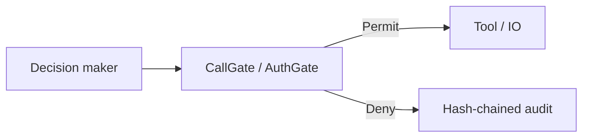

# authgate-kernel

**The authorization layer between any decision and any IO.**

Wherever something decides and something else executes, this verifies the actor
holds a valid, signed, non-revoked capability for the resource. No proof, no execution.

Not a framework plugin. Not model-specific. Not tied to today's agent architectures.
A wire format and a verify function. See [POSITIONING.md](POSITIONING.md).

**Deployable verifier API:** [`INFRA.md`](INFRA.md) — Docker/compose, `/readyz`, admin-gated
registry mutation, attenuating `/delegate`.




> **Related — legitimacy above authority.** AuthGate answers *authority*: “does this
> agent hold a valid capability for resource X?” The prior *legitimacy* veto
> (“should this happen at all?”) is a separate DENY-only evaluator layer (historically
> the Freedom Decision Kernel sibling). **Pipeline:** identity → legitimacy (DENY-only)
> → **AuthGate authority** → PEP execute + audit. Legitimacy may only DENY; authority
> never overrides a legitimacy denial.

[](https://github.com/Aliipou/authgate-kernel/actions)
[](authgate-kernel/)
[](tests/)
[](formal/)
[](formal/lean4/)
[](LICENSE)

**Review / ops:** [`REVIEW_PACKET.md`](REVIEW_PACKET.md) · [`ASSUMPTIONS.md`](ASSUMPTIONS.md) · [`INFRA.md`](INFRA.md) · [`CHATGPT_REVIEW_BRIEF.md`](CHATGPT_REVIEW_BRIEF.md)

Optional Theory-of-Freedom lineage maps live under [`PHILOSOPHY/`](PHILOSOPHY/) when present — they do not change the TCB.

## The problem

> Any decision-maker can execute IO without proving authority.

Today's decision-makers are LLM agents. Tomorrow's may be planners, AGI subagents,
or autonomous economic actors. Authorization gaps in this chain do not depend on
which decision-maker is at the top.

## What this is

Puts a structural gate between the decision and the IO:

```
[Any decision-maker]  →  CallGate (verify authority proof)  →  [Any IO target]
                              ↓ if denied
                         audit log entry, action does not execute
```

The gate answers one question, structurally:

> *Does this actor hold a valid, non-expired, cryptographically signed capability for this resource and these rights, in a chain traceable to its trust root?*

`Decision::Permit` or `Decision::Deny { reason }`. Same inputs → same output, always.
No probability scores. No LLM calls. No network I/O inside the gate.

## The contract

The thing external systems implement is the JSON wire format:

- [`spec/canonical_action.schema.json`](spec/canonical_action.schema.json) — what you submit
- [`spec/gate_result.schema.json`](spec/gate_result.schema.json) — what you receive
- [`spec/audit_entry.schema.json`](spec/audit_entry.schema.json) — what gets logged

Any system that can produce and consume these JSON shapes integrates with authgate.
No framework dependency exists at this layer.

Adapters for popular frameworks (LangChain, OpenAI Agents SDK, Anthropic, AutoGen,
CrewAI, LangGraph, DSPy, MCP) live in `src/authgate/adapters/` as **conveniences,
not as the product**. When a framework dies, its adapter dies. The wire format lives.

This is the same principle as capability-based OS security (seL4, CHERI), applied to autonomous agent tool execution.

---

## What it does NOT do

| Not this | Why |
|---|---|
| Alignment | Alignment is about values. This kernel is about typed authority. |
| Intent verification | The kernel does not parse or interpret natural language. |
| Ethics enforcement | Ethical reasoning requires semantic content — this is structural. |
| Side-channel defense | Timing attacks, covert channels — out of scope by design. |
| Python-equivalent security | The Python layer is a compatibility runtime — not formally checked. |

The Python layer (`src/authgate/`) is a **compatibility runtime, not a security boundary**. It mirrors the *shape* of the TCB's checks for ergonomics, prototyping, and tests — but it is **not formally verified and is bypassable**: a malicious Python tool can call `subprocess` directly. Only the Rust TCB (`authgate-kernel/src/tcb/`) carries the security guarantees. Treat every `src/authgate/**` module as untrusted regardless of how authoritative its filename sounds. The Rust WASM sandbox closes the execution gap at the OS level — see [Engineering Gaps](#engineering-gaps) below.

Full enumeration: [`formal/INCOMPLETENESS.md`](formal/INCOMPLETENESS.md)

---

## Numbers that matter

| Metric | Value |
|---|---|
| Security-enforcing Rust LOC | `engine.rs`: 250 LOC. Full path (`engine.rs` + `dag.rs` + `call_gate.rs`): ~934 LOC |
| Rust kernel-crate lib tests (`cargo test --lib`) | 293 (all passing) — includes the consent TCB gate and 47 red-team attack tests |
| Python integration tests | 905 (all passing) |
| Kani harnesses (bounded model checking) | 19 (all proved) |
| Lean 4 theorems | 16 (4 fully proved scope theorems + 2 admitted; 2 crypto axioms) |
| Wire boundary attack classes | 18 (WA-1 through WA-18); 37 pytest assertions in `test_wire_hardening.py` |
| Concurrent verify() calls (stress test) | 1 000 via ThreadPoolExecutor, 200 concurrent audit appends |
| Python verify() latency | p50 ≈ 9.7µs (10-claim registry), 17.4µs (1 000-claim) |
| Delegation lattice theorems | T1–T4 proved: transitivity, anti-monotone, DAG, bounded distributive lattice |
| TLA+ invariants | 9 + PermitSoundness — **TLC completed 2026-08-20** (bounded model `Len(audit_log)≤1`, safety-only; see `formal/tlc_run.log` / `formal/COVERAGE.md`) |

---

## Theory → Engineering coverage (نظریه آزادی)

The `nazariye-azadi` line maps the Theory of Freedom's seven axioms to code (see
[`PHILOSOPHY/AXIOM_MAP.md`](PHILOSOPHY/AXIOM_MAP.md) and
[`Theory_to_Engineering_Plan.md`](Theory_to_Engineering_Plan.md)). Three axioms
that previously lived only in the Python layer now have first-class Rust:

| Axiom | Module | Trust level | What it guarantees |
|---|---|---|---|
| **A3** — consent must be recorded, not assumed | `authgate-kernel/src/tcb/consent.rs` | **TCB** — in the trusted core | When the adapter sets `requires_consent`, no `Permit` is possible without a consent record that ed25519-verifies under its claimed grantor key, is unexpired and unrevoked, and covers the actor, resource, and rights. Folded into the binding hash (tamper-evident). The kernel does **not** verify the grantor is the resource's rightful owner — that is the policy layer's job (L2). |
| **A4/A5** — no action may coerce or deceive | `authgate-kernel/src/semantic_gate.rs` | **NOT TCB** — advisory heuristic | A typed `SemanticGate` interface + `CoercionAnalyzer` (exit-blocking, HHI concentration, deception markers). Returns a `SemanticVerdict`; it **never structurally denies** — it is an input to a policy decision. |
| **A7** — MahdaviCompass (move toward the final order) | `authgate-kernel/src/compass/` | **NOT TCB** — advisory scorer | `C(a) = w₁·RVD + w₂·VOI + w₃·CD` as a **post-hoc scorer that annotates, never denies**. Any deny threshold is operator policy, not theory (`flagged_below`). |

Each ships with adversarial coverage: `consent_redteam.rs` (18), `semantic_gate_redteam.rs`
(15), and `compass/redteam.rs` (14) — including honest tests for known heuristic
evasions (e.g. unicode homoglyphs) and a test asserting the Compass never denies.

---

## Architecture

```
Human Principal  (trust root)
        │  signs CapabilityProof chains
        │  sets min_epoch to revoke cohorts
        ▼
CanonicalAction  (sealed by adapter)
   actor_id, resource_hash, required_rights,
   capability_proofs[], revocation_proofs[],
   nonce, timestamp, min_epoch,
   binding_hash = SHA-256(all fields above)
        │
        ▼
┌──────────────── CallGate ─────────────────────────────┐
│  [L1] verify binding_hash             (AT-1)          │
│  [L2] for each cap where subject == actor:            │
│       resource_hash match?            (AT-6.1)        │
│       expiry >= now?                  (AT-3.6)        │
│       epoch >= min_epoch?             (AT-3.2)        │
│       validate_chain():                               │
│         depth ≤ 16                   (AT-2.7)        │
│         each node epoch >= min_epoch  (AT-3.1)        │
│         ed25519 valid                 (AT-2.3/4)      │
│         SHA-256(pubkey)==subject_id   (AT-5.1)        │
│         rights ⊆ parent.rights       (AT-2.6)        │
│       rights sufficiency                              │
│  [L3] root-signed revocations        (AT-3.3/4)      │
└───────────────────────────────────────────────────────┘
        │
   Decision::Permit  or  Decision::Deny { reason }
        │
        ▼
  AuditLog  (SHA-256 hash-chained, tamper-evident, thread-safe)
```

**Security-enforcing critical path:** `engine.rs` (114 LOC) + `dag.rs` (101 LOC) + `call_gate.rs` (40 LOC) = ~255 LOC. `#![forbid(unsafe_code)]` across all TCB files. `engine::verify` is `pub(crate)` — bypassing `CallGate` is a compile-time type error (AT-7.5 closed).

**Identity binding:** `subject_id = SHA-256(issuer_pubkey)`. Every delegation node must satisfy this. An attacker who knows a parent proof hash but not the parent private key cannot forge a child.

**Revocation:** Set `min_epoch` in each action. All proofs with `epoch < min_epoch` are rejected. No revocation list required — advancing the epoch invalidates an entire compromised cohort in O(1).

---

## Repository layout

```
freedom-kernel/src/
  tcb/               ← TRUSTED COMPUTING BASE — all security guarantees live here
    call_gate.rs       CallGate — only public TCB entry point
    engine.rs          pub(crate) verify(action, root_key, now) → Decision
    dag.rs             delegation chain traversal + attenuation + resource propagation
    types.rs           CanonicalAction, CapabilityProof, RevocationProof, Rights
    tests.rs           73 tests — one per security invariant path
    hardening_tests.rs 31 adversarial tests (resource redirection, crypto, proptest)
  sequence.rs        SequenceContext — policy helper (NOT in TCB)
  sandbox.rs         SandboxedExecutor — WASM capability-gated tool runner

formal/
  authgate_v3.tla    TLA+ state machine (9 invariants + PermitSoundness)
  kani/              Kani harnesses (19 harnesses — all proved)
  lean4/             Lean 4 proofs (7 theorems)
  COVERAGE.md        What is and is not formally verified
  INCOMPLETENESS.md  Explicit enumeration of gaps

attack_harness/
  wire_attacks.py        27 wire boundary tests (WA-1 through WA-18)
  differential_tests.py  20 differential tests (Python model boundary semantics)
  mutation_attacks.py    20 mutation tests
  simulation/            231-scenario adversarial simulation engine

src/authgate/        Python compatibility runtime (NOT TCB)
  kernel/            FreedomVerifier, OwnershipRegistry, AuditLog, Action
    distributed_kernel.py   Merkle state, threshold revocations, partition policy
    recursive_governance.py  Delegation depth bounds, anti-feudal, revocation propagation
    constitutional_economy.py  Oligarchy detection, sovereignty erosion, lock-in
    exit_guarantees.py      Exit rights, identity portability, revocation reachability
    federation.py           Cross-kernel federation, constitutional consensus
    multi_agent_coordinator.py  Coalition detection, dependency graph analysis
    sandbox_executor.py     Capability-gated tool execution (Python layer)
    consent.py              ConsentCapability — revocable, contextual, non-delegable
    inalienable.py          InnalienableRights — structural rights that cannot be waived
    sovereign_identity.py   Commitment-based selective disclosure (ZK-compatible)
    persuasion.py           PersuasionBoundaryChecker — structural manipulation detection
    anti_capture.py         AntiCaptureChecker — scope drift, credential access
    coercion.py             CoercionAnalyzer — formal coercion boundary detection
    override_detector.py    OverrideDetector — lock-in pattern detection
    sovereignty_metrics.py  HHI-based dependency, reversibility index, agency score
    tool_abi.py             Typed tool ABI — ToolSchema, ToolParam, ToolABIRegistry
    audit.py                AuditLog — SHA-256 hash-chain + Ed25519 signed export
  key_rotation.py    RotationCertificate, ActiveKeySet, key rotation protocol
  errors.py          Typed exception hierarchy (AuthgateError → …)
  cli.py             authgate-cli — verify / audit / key subcommands
  adapters/          Framework adapters (LangChain, OpenAI, Anthropic, AutoGen, DSPy)
  extensions/        Heuristic layers (IFC, manipulation scorer) — not TCB

examples/
  langchain_integration/demo.py   End-to-end integration demo (Phase D2)
```

---

## Quick start

### Rust (TCB — use this for production)

```rust
use authgate_kernel::tcb::{
    call_gate::CallGate,
    types::{CanonicalAction, Decision, RIGHT_READ},
};

let gate = CallGate::new(root_verifying_key);
let mut action = build_canonical_action(/* ... */);
action.binding_hash = action.compute_hash();

match gate.execute(&action, unix_now()) {
    Decision::Permit => execute_action(),
    Decision::Deny { reason } => reject(reason),
}
```

### Python (non-TCB compatibility runtime)

```python
from authgate.kernel.entities import AgentType, Entity, Resource, ResourceType, RightsClaim
from authgate.kernel.registry import OwnershipRegistry
from authgate.kernel.verifier import Action, FreedomVerifier
from authgate.kernel.audit import AuditLog

# Build registry once
registry = OwnershipRegistry()
human = Entity("alice", AgentType.HUMAN)
bot   = Entity("analyst-bot", AgentType.MACHINE)
data  = Resource("sales-data", ResourceType.DATASET, scope="/data/sales/")

registry.register_machine(bot, human)
registry.add_claim(RightsClaim(bot, data, can_read=True))

# Freeze registry before verifying (eliminates TOCTOU)
frozen   = registry.freeze()
audit    = AuditLog(path="/var/log/authgate.jsonl")
verifier = FreedomVerifier(frozen, audit_log=audit)

result = verifier.verify(Action("read-sales", actor=bot, resources_read=[data]))
print(result.summary())
# [PERMITTED] read-sales (confidence=1.00, manipulation=0.00)

# Verify audit chain integrity
assert audit.verify_chain()
```

### CLI

```bash
pip install -e .

# Verify an action against a registry file
authgate-cli verify --registry registry.json --action action.json --audit log.jsonl

# Verify audit log chain integrity
authgate-cli audit verify /var/log/authgate.jsonl

# Replay entry 42
authgate-cli audit replay /var/log/authgate.jsonl 42

# Audit statistics
authgate-cli audit stats /var/log/authgate.jsonl
```

### WASM sandbox (feature-gated)

```bash
cargo build --features sandbox
```

`SandboxedExecutor` wraps `CallGate` — permitted actions run inside a WASM instance whose host function imports are limited to the rights bitmask. An action permitted by the gate but requesting an unlisted host function fails at WASM instantiation time, not at runtime.

---

## Running tests

```bash
# Rust TCB
cd freedom-kernel
cargo test --lib
cargo test --features sandbox

# Kani model checking
cargo kani --harness prop_attenuation_two_node
cargo kani --harness prop_epoch_check
cargo kani --harness proof_forged_revocation_ignored

# Lean 4
cd formal/lean4 && lake build

# Python integration (273 tests)
pip install -e ".[dev]"
pytest

# Python attack harness
python attack_harness/wire_attacks.py
python attack_harness/differential_tests.py
python attack_harness/mutation_attacks.py

# Integration demo
python examples/langchain_integration/demo.py
```

---

## Security invariants (TCB)

Nine invariants enforced on every `verify()` call, in strict order:

| # | Name | Claim |
|---|---|---|
| I1 | CanonicalBinding | `action.binding_hash == SHA-256(all other fields)` |
| I2 | IdentityBinding | `cap.subject_id == action.actor_id` |
| I3 | ExpiryGate | `cap.expiry >= now` |
| I4 | EpochSafety | `cap.epoch >= action.min_epoch` (leaf + all chain nodes) |
| I5 | ResourceBinding | `cap.resource_hash == action.resource_hash` |
| I6 | Attenuation | `child.rights ⊆ parent.rights` at every delegation step |
| I7 | ChainEpoch | Every intermediate chain node satisfies EpochSafety |
| I8 | ChainComplete | Every `Delegated` cap in a Permit has a valid parent in the bundle |
| I9 | RevocationSafety | Only root-signed revocations affect decisions |

**Minimal generating set:** {I2, I3, I4, I5, I6, I7, I8} — I1 and I9 are implied by structural integrity.

---

## Branch layout

| Branch | Role | Merge rule |
|---|---|---|
| `main` | Production — the only branch that deploys | CI green + all attack classes closed |
| `spec-core` | Formal spec — TLA+, Lean 4, threat model | TLC-verified or Lean-discharged |
| `tcb-core` | Rust kernel — `call_gate.rs`, `engine.rs`, `dag.rs` | CI + attack regression clean |
| `adversarial-lab` | Attack harness — black-box probes | Never merges to main directly |
| `integration` | Python runtime, adapters, CLI | TCB contract satisfied |

Merge path: `adversarial-lab → spec-core → tcb-core → main` and `integration → main`.

---

## Engineering Gaps

The gap between `Permit/Deny` and actual constrained execution:

| Gap | Status | What closes it |
|---|---|---|
| **WASM sandbox** (`cargo build --features sandbox`) | Blocked: Windows SDK kernel32.lib missing | Install Windows SDK 10.0.22621 or build on Linux |
| **OS-level confinement** (seccomp-bpf) | Not implemented | Wrap tool subprocess with seccomp filter |
| **End-to-end integration test** | **Done** (`tests/test_integration_e2e.py`) | 18 assertions: tool call → gate → audit chain |
| **TLC model checker** | Java not installed | `java -jar tla2tools.jar -tool MC_AuthGateV3` |
| **CLI** | Exists; not packaged | `pip install authgate-kernel` |

The WASM sandbox is the most important. When it exists, the enforcement chain becomes:
```
Agent → CallGate → Capability-bound WASM instance → restricted host imports → actual IO
```
A tool that imports `write_byte` but was only granted `RIGHT_READ` fails at WASM instantiation — a missing symbol, not a runtime check.

## Explicit limitations

| # | Limitation |
|---|---|
| L1 | Semantic content not checked — natural language intent is not gated |
| L2 | Malicious trust root is out of scope |
| L3 | Side channels not addressed (timing, covert, steganography) |
| L4 | Python runtime is not formally checked |
| L5 | Extensions (IFC, manipulation scorer) are heuristic, not TCB |
| L6 | Distributed consistency: `distributed_kernel.py` covers the Python layer; Rust distributed consensus is future work |
| L7 | No implementation-level refinement proof from TLA+ to Rust |
| L8 | Clock integrity is caller-supplied — compromised clock not detected |

---

## Contributing

Before opening a PR on `src/tcb/`, answer:

> *Can this feature exist entirely outside `src/tcb/`?*

If yes, it doesn't belong in the TCB. TCB changes require a written invariant justification in `spec-core`, a Kani or Lean proof, and a regression test in `adversarial-lab`. See [`CONTRIBUTING.md`](CONTRIBUTING.md) and [`BRANCHES.md`](BRANCHES.md).

---

## License

**Source-available** under the [PolyForm Noncommercial License 1.0.0](LICENSE) — see also [`NOTICE`](NOTICE).

| Use | Status |
|---|---|
| Evaluation | ✅ Allowed |
| Research | ✅ Allowed |
| Educational | ✅ Allowed |
| Internal non-commercial testing | ✅ Allowed |
| Redistribution (non-commercial) | ✅ Allowed, with attribution |
| Production deployment | ⛔ Requires commercial license |
| Commercial use / SaaS / resale | ⛔ Requires commercial license |
| Patent rights | Reserved |

A **commercial license is available separately.** For production or commercial use,
contact **Ali Pourrahim — Alipourrahim.ap@gmail.com**.
