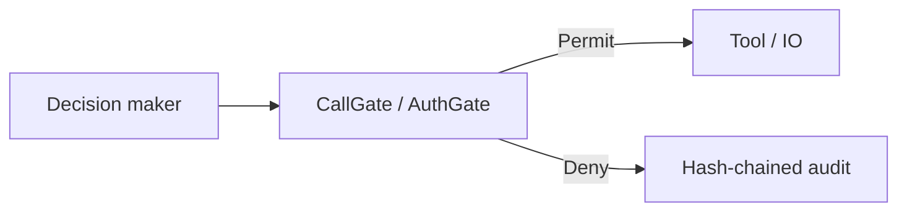
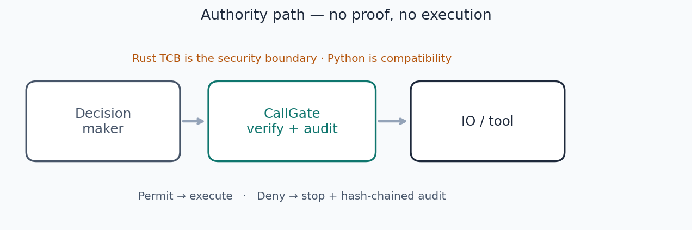
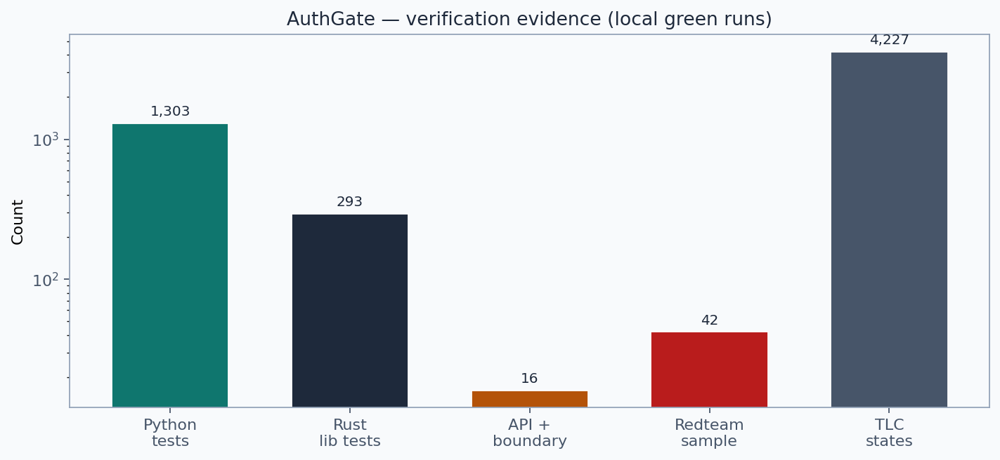

# authgate-kernel

**A capability gate between any decision and any real-world action.**

If an agent, planner, or service wants to read a file, call an API, or move money, AuthGate checks one structural question first:

> Does this actor hold a valid, signed, non-revoked capability for this resource and these rights?

No valid proof → the action does not run. Same inputs always yield the same Permit or Deny. No LLM calls inside the gate. No probability scores.

Not a LangChain plugin. Not model-specific. The product is a **wire format** plus a **verify function**. Framework adapters are convenience glue — when a framework goes away, the contract stays. See [POSITIONING.md](POSITIONING.md).

**Deployable verifier API:** [INFRA.md](INFRA.md) — Docker Compose, `/readyz`, admin-gated registry mutation, attenuating `/delegate`.







[](https://github.com/Aliipou/authgate-kernel/actions)
[](authgate-kernel/)
[](tests/)
[](formal/)
[](formal/lean4/)
[](LICENSE)

**Review / ops:** [REVIEW_PACKET.md](REVIEW_PACKET.md) · [ASSUMPTIONS.md](ASSUMPTIONS.md) · [INFRA.md](INFRA.md)

---

## Why this exists

Autonomous systems increasingly decide *and* act. The decision step (LLM, planner, workflow) can propose tool calls faster than humans can review them. Most stacks still treat “the agent asked for it” as enough authority.

That leaves a predictable failure mode: an actor executes IO without a cryptographically checkable proof that it was allowed to. Prompt framing, framework bugs, or a compromised sub-agent should not be able to invent authority.

AuthGate puts a small, deterministic gate on that arrow:

```text
[Any decision-maker]  →  CallGate (verify capability proof)  →  [Any IO]
                              ↓ if denied
                         audit entry; action does not execute
```

Today the decision-maker is often an LLM agent. Tomorrow it may be a planner, a swarm, or another machine. The gate does not care — it only checks the proof.

---

## What you get

| Capability | What it means in practice |
|---|---|
| **Signed capability chains** | Ed25519-signed proofs; identity bound as `subject_id = SHA-256(pubkey)` |
| **Attenuation** | A child can only receive a subset of a parent’s rights — never amplify |
| **Epoch revocation** | Raise `min_epoch` to invalidate a compromised cohort in O(1); no giant denylist required |
| **Deterministic decisions** | Same action + same trust root + same time → same Permit/Deny |
| **Tamper-evident audit** | Hash-chained log of gate decisions |
| **Small Rust TCB** | Security-critical path is a few hundred LOC with `#![forbid(unsafe_code)]` |
| **JSON wire contract** | Integrate by producing/consuming schemas — no framework lock-in |
| **Partial formal coverage** | TLA+ model checked (safety), Kani harnesses, Lean 4 theorems — see honesty section below |

**Wire schemas (the integration contract):**

- [`spec/canonical_action.schema.json`](spec/canonical_action.schema.json) — what you submit
- [`spec/gate_result.schema.json`](spec/gate_result.schema.json) — what you receive
- [`spec/audit_entry.schema.json`](spec/audit_entry.schema.json) — what gets logged

Adapters for LangChain, OpenAI Agents SDK, Anthropic, AutoGen, CrewAI, LangGraph, DSPy, and MCP live under `src/authgate/adapters/` as **optional conveniences**, not as the product.

This is the same family of idea as capability-based OS security (seL4, CHERI), applied to agent tool execution rather than to syscalls.

---

## How it compares (honestly)

AuthGate is **not** “a better OPA.” General policy engines already answer *“is this principal allowed to do this action on this resource right now?”* Cedar is formally verified as a policy language; Zanzibar / OpenFGA scale relationship-based access; OPA’s Rego is highly expressive. We do not claim to replace those systems for service mesh, cloud IAM, or classic ABAC.

What we *do* claim, based on a written comparative evaluation ([COMPARATIVE_EVALUATION.md](COMPARATIVE_EVALUATION.md), kill-tests in [WHY_NOT_OPA.md](WHY_NOT_OPA.md) / [WHY_NOT_DLP.md](WHY_NOT_DLP.md)):

| System | Strength | Gap relative to agent tool gates |
|---|---|---|
| **OPA / Rego** | Flexible policy language for services | Not built around signed capability *delegation chains*; formal verification of the interpreter is not the product story |
| **AWS Cedar** | Formally verified *authorization language* | Point-in-time allow/deny; no agent-oriented capability DAG + epoch cohort revoke as first-class primitives |
| **Zanzibar / OpenFGA** | Global ReBAC; revocation via tuple delete | Excellent relationship graphs; not a per-tool-call capability proof + attenuation lattice for agent runtimes |
| **DLP / lineage / PBAC** | Catch sensitive content at egress or purpose at query time | Usually outside the agent loop; do not bind “obtained under capability C” to later tool sinks |
| **Object-capability OS (Capsicum, EROS)** | Strong confinement theory | Process/OS layer — not a portable JSON gate for LLM tool calls |
| **Sandboxes (gVisor, Firecracker)** | Isolate processes/VMs | Isolation ≠ typed authority for which *agent action* may run |

**AuthGate’s practical niche:** a small, auditable **authority check at the agent↔tool boundary** — signed proofs, attenuation, epoch revoke, hash-chained decisions — with a path toward purpose/flow controls layered on capabilities. That is narrower than “replace enterprise IAM,” and stronger than “another LangChain middleware.”

If you only need Rego policies for a REST API, use OPA. If you need relationship tuples at global scale, use OpenFGA. If you need a capability gate in front of agent tools with cryptographic proofs and a tiny verified core, evaluate AuthGate.

---

## What it does *not* do

| Not this | Why |
|---|---|
| Model alignment / ethics | Values and intent need semantics; this gate is structural |
| Natural-language intent parsing | The kernel does not interpret prompts |
| Side-channel defense | Timing and covert channels are out of scope ([THREAT_MODEL.md](THREAT_MODEL.md)) |
| Python as the security boundary | `src/authgate/` is a compatibility runtime — **bypassable**; only the Rust TCB carries the security claims |
| Perfect formal completeness | Partial proofs and bounded model checking — not a full refinement proof from TLA+ to Rust |

Full gap list: [formal/INCOMPLETENESS.md](formal/INCOMPLETENESS.md). Assumptions that must hold for claims to apply: [ASSUMPTIONS.md](ASSUMPTIONS.md).

Optional philosophy / Theory-of-Freedom notes live under [`PHILOSOPHY/`](PHILOSOPHY/) and [FREEDOM_THEORY_POSITION.md](FREEDOM_THEORY_POSITION.md). They are **not** the industrial claim and do not expand the TCB.

---

## Numbers (as of current `main`)

| Metric | Value |
|---|---|
| Security-enforcing Rust path | `engine.rs` + `dag.rs` + `call_gate.rs` — on the order of a few hundred LOC |
| Rust crate lib tests | ~293 (`cargo test --lib`) |
| Python / integration tests | 1300+ passing |
| Kani harnesses | 19 proved (bounded) |
| Lean 4 | Partial — several scope theorems proved; crypto treated as axioms where noted |
| TLA+ / TLC | Safety model checked 2026-08-20 (bounded; see `formal/COVERAGE.md`) |
| Python `verify()` latency (indicative) | p50 ≈ 10–17 µs depending on registry size |

Treat formal badges as **evidence of engineering discipline**, not as a certificate that every deployment is secure. Crypto implementations and clock integrity remain caller/environment responsibilities unless separately attested.

---

## Architecture (short)

```text
Human principal (trust root)
        │  signs CapabilityProof chains; sets min_epoch to revoke
        ▼
CanonicalAction  (actor, resource, rights, proofs, nonce, binding_hash)
        ▼
CallGate  — binding → identity → expiry → epoch → resource → attenuation → revocations
        ▼
Decision::Permit  |  Decision::Deny { reason }
        ▼
AuditLog (SHA-256 hash-chained)
```

**Identity binding:** every delegation node must satisfy `subject_id = SHA-256(issuer_pubkey)`. Knowing a parent proof hash without the private key is not enough to forge a child.

**Revocation:** advance `min_epoch` on actions; proofs below that epoch fail. Cohort kill without maintaining a long revocation list.

Nine TCB invariants (binding, identity, expiry, epoch, resource, attenuation, chain epoch/completeness, revocation safety) are listed under [Security invariants](#security-invariants-tcb).

---

## Quick start

### Docker verifier API

```bash
cp .env.example .env   # set AUTHGATE_ADMIN_TOKEN
docker compose up --build -d
curl -s localhost:8000/readyz
```

Details: [INFRA.md](INFRA.md).

### Rust (TCB — prefer for production enforcement)

```rust
use authgate_kernel::tcb::{
    call_gate::CallGate,
    types::{CanonicalAction, Decision, RIGHT_READ},
};

let gate = CallGate::new(root_verifying_key);
let mut action = build_canonical_action(/* ... */);
action.binding_hash = action.compute_hash();

match gate.execute(&action, unix_now()) {
    Decision::Permit => execute_action(),
    Decision::Deny { reason } => reject(reason),
}
```

### Python (compatibility runtime — not the security boundary)

```python
from authgate.kernel.entities import AgentType, Entity, Resource, ResourceType, RightsClaim
from authgate.kernel.registry import OwnershipRegistry
from authgate.kernel.verifier import Action, FreedomVerifier
from authgate.kernel.audit import AuditLog

registry = OwnershipRegistry()
human = Entity("alice", AgentType.HUMAN)
bot = Entity("analyst-bot", AgentType.MACHINE)
data = Resource("sales-data", ResourceType.DATASET, scope="/data/sales/")

registry.register_machine(bot, human)
registry.add_claim(RightsClaim(bot, data, can_read=True))

frozen = registry.freeze()
audit = AuditLog(path="/var/log/authgate.jsonl")
verifier = FreedomVerifier(frozen, audit_log=audit)

result = verifier.verify(Action("read-sales", actor=bot, resources_read=[data]))
print(result.summary())
assert audit.verify_chain()
```

### CLI

```bash
pip install -e .
authgate-cli verify --registry registry.json --action action.json --audit log.jsonl
authgate-cli audit verify /var/log/authgate.jsonl
```

### WASM sandbox (feature-gated)

```bash
cargo build --features sandbox
```

`SandboxedExecutor` wraps `CallGate` so permitted actions run with host imports limited to the rights bitmask. On Linux, pair with `SeccompExecutor` / `SeccompCallGate` for subprocess syscall confinement using the same rights mapping (`authgate-kernel/src/seccomp.rs`).

---

## Running tests

```bash
# Rust TCB
cd authgate-kernel && cargo test --lib

# Kani (selected harnesses)
cargo kani --harness prop_attenuation_two_node
cargo kani --harness prop_epoch_check
cargo kani --harness proof_forged_revocation_ignored

# Lean 4
cd formal/lean4 && lake build

# Python
pip install -e ".[dev]"
pytest

# Attack harness
python attack_harness/wire_attacks.py
python attack_harness/differential_tests.py
python attack_harness/mutation_attacks.py
```

---

## Security invariants (TCB)

Enforced on every `verify()` / `CallGate::execute`, in order:

| # | Name | Claim |
|---|---|---|
| I1 | CanonicalBinding | `binding_hash == SHA-256(other fields)` |
| I2 | IdentityBinding | capability subject matches actor |
| I3 | ExpiryGate | capability not expired |
| I4 | EpochSafety | leaf epoch ≥ `min_epoch` |
| I5 | ResourceBinding | capability resource matches action |
| I6 | Attenuation | child rights ⊆ parent rights at every hop |
| I7 | ChainEpoch | intermediate nodes also satisfy epoch |
| I8 | ChainComplete | every delegated cap in a Permit has a valid parent in the bundle |
| I9 | RevocationSafety | only root-signed revocations affect decisions |

---

## Repository layout

```text
authgate-kernel/     Rust kernel; TCB under src/tcb/
formal/              TLA+, Kani, Lean 4, coverage & incompleteness notes
attack_harness/      Wire / differential / mutation probes
src/authgate/        Python compatibility runtime + adapters (not TCB)
spec/                JSON Schema wire contract
examples/            Integrations (incl. Kubernetes sidecar sketch)
docs/figures/        Architecture diagrams
```

---

## Engineering gaps

All items from the original gap audit are **closed or explicitly scoped**. None remain open.

| Item | Resolution |
|------|------------|
| WASM sandbox | **Closed** — Linux CI (`.github/workflows/sandbox.yml`); Windows local dev optional (SDK in [DEPLOYMENT.md](DEPLOYMENT.md)) |
| OS-level confinement (seccomp-bpf) | **Closed** — Linux CI adversarial test + rights-derived allowlist (`.github/workflows/seccomp.yml`); Windows/macOS: subprocess isolation only |
| TLC / Java tooling | **Closed** — CI-verified (`.github/workflows/formal.yml`); log in `formal/tlc_run.log` |
| CLI packaging | **Closed** — `authgate-cli` entry point + fresh-venv CI smoke; PyPI publish is release ops, not a gate gap |
| Refinement proof TLA+ → Rust | **Out of scope** — limitation L7, not an engineering gap |
| Distributed consensus in Rust TCB | **Non-goal** — [NON_GOALS.md](NON_GOALS.md) |

**Infra-ready bar:** this table must stay empty of open rows; see [INFRA.md](INFRA.md).

The intended long-term enforcement chain:

```text
Agent → CallGate → capability-bound WASM (or OS sandbox) → restricted IO
```

---

## Explicit limitations

| # | Limitation |
|---|---|
| L1 | Semantic content / natural-language intent is not gated |
| L2 | A malicious trust root is out of scope |
| L3 | Side channels not addressed |
| L4 | Python runtime is not formally verified |
| L5 | Heuristic extensions (IFC helpers, scorers) are not TCB |
| L6 | Clock is caller-supplied — use `SessionClock` / monotonic sourcing; backward jumps rejected within a session (see `TCB_DISCIPLINE.md`) |
| L7 | No implementation-level refinement proof from TLA+ to Rust |

---

## Contributing

Before changing anything under the TCB (`authgate-kernel/src/tcb/`):

> Can this feature live entirely *outside* the TCB?

If yes, keep it out. TCB changes need an invariant justification, proof or model-check evidence where applicable, and regression coverage. See [CONTRIBUTING.md](CONTRIBUTING.md) and [BRANCHES.md](BRANCHES.md).

---

## License

**Source-available** under the [PolyForm Noncommercial License 1.0.0](LICENSE) — see also [NOTICE](NOTICE).

| Use | Status |
|---|---|
| Evaluation / research / education | Allowed |
| Internal non-commercial testing | Allowed |
| Redistribution (non-commercial, with attribution) | Allowed |
| Production / commercial / SaaS / resale | Requires a commercial license |
| Patent rights | Reserved |

For production or commercial use, contact **Ali Pourrahim — Alipourrahim.ap@gmail.com**.
