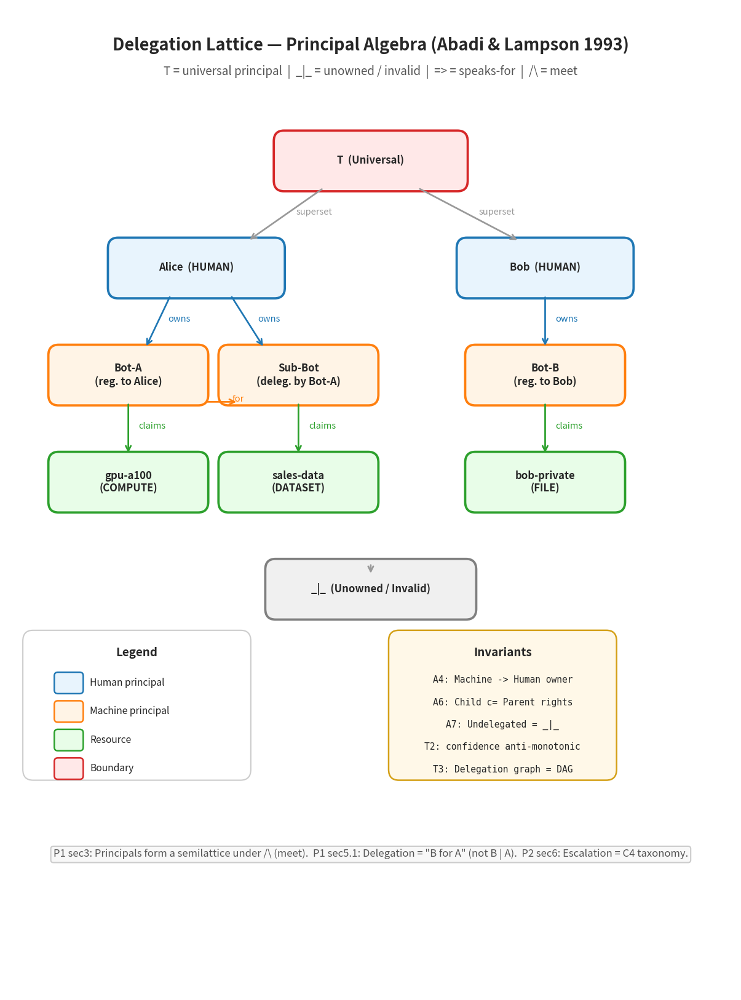

# Release Brief — Delegate Reputation Extension (DRE) v2.5.0

**Prepared:** 2026-08-22  
**Status:** PR-ready  
**Test suite:** 1,400 passed, 1 skipped, 0 failed  
**Benchmark:** 2.8 ms p99 on 10k-entry history (target <5 ms)

---

## 1. Executive Summary

The Delegate Reputation Extension (DRE) closes the 33-year-old "reasonable delegate" gap identified in Abadi & Lampson (1993) §5.1. It is a production-hardened behavioral-reputation layer that scores delegation candidates before the capability gate opens. The DRE can only escalate `Permit → Deny`; a compromised DRE cannot cause a false-negative permit. This is the fail-safe invariant.

**What changed:** 7 new modules, 46 new tests, 4 production attestation paths, and a 2.8 ms p99 latency guarantee.

**Why it matters:** P1's "is B a reasonable delegate for A?" was unformalized from 1993 to 2026. With LLM agents now acting as non-deterministic delegates, this gap became urgent. The DRE answers it with DCRS scoring, NDC risk weights, and external attestation — without modifying the kernel's TCB.

---

## 2. New Modules

| File | Lines | Purpose |
|------|-------|---------|
| `src/authgate/extensions/delegate_reputation.py` | ~320 | `DelegateReputationEngine` — DCRS scoring, NDC risk weights, chain-depth attenuation, external attestation integration |
| `src/authgate/extensions/historical_behavior_store.py` | ~280 | SQLite-backed append-only HBS with covering index (`idx_actor_ts_covering`) and partial indexes |
| `src/authgate/extensions/hbs_protection.py` | ~180 | `GuardedBehaviorStore` — rate-limiting, burst detection, NDC spoofing detection, daily resource-breadth limits |
| `src/authgate/extensions/attestation.py` | ~420 | Pluggable attestors: SPIFFE/SVID, AWS IAM, GCP IAM, Azure IAM, plus `CompositeAttestor` and `NullAttestor` |
| `docs/attestation.md` | ~140 | Operator-facing documentation and custom attestor guide |
| `benchmarks/dre_benchmark.py` | ~130 | Performance benchmark script |
| `examples/langchain_integration/demo_with_dre.py` | ~90 | End-to-end LangChain adapter with NDC |

**Changed modules:** `delegate_reputation.py` (optimized `query_summary`), `historical_behavior_store.py` (3 new indexes), `attestation.py` (AWS ARN fix, GCP fallback fix).

---

## 3. New Tests

| File | Tests | Coverage |
|------|-------|----------|
| `tests/test_dre_adversarial.py` | 10 | Monotonicity, human safety, history poisoning, NDC spoofing, threshold probing, burst attacks, resource breadth explosion, failed attestation flooding, TCB supremacy |
| `tests/test_attestation_production.py` | 26 | SPIFFE/SVID, AWS IAM, GCP IAM, Azure IAM (all mocked), `CompositeAttestor`, `NullAttestor`, penalty edge cases, stub-mode parametrization |
| `tests/test_hbs_protection.py` | 10 | Rate limiting, burst detection, NDC spoofing detection, daily resource-breadth limits, concurrent write safety |

**Total new tests:** 46. **Full suite:** 1,400 passed, 1 skipped.

---

## 4. Design Decisions

### 4.1 Fail-safe by construction
The DRE receives the kernel's verdict first and can only add penalties. If the kernel says DENY, the DRE returns DENY immediately. This mirrors A&L's "fail-closed" principle: the TCB (kernel) is the floor; reputation is a ceiling.

### 4.2 NDC (Non-Determinism Class) risk weights

| NDC | Description | Risk weight |
|-----|-------------|-------------|
| `HUMAN` | Human operator | 0.0 |
| `DETERMINISTIC` | Deterministic program | 0.1 |
| `LLM_CLOSED` | Closed-weight LLM | 0.3 |
| `LLM_OPEN` | Open-weight / fine-tuned LLM | 0.5 |
| `EXTERNAL` | Unknown / untrusted | 0.7 |

This addresses P1's "reasonable delegate" question by making the delegate's **intrinsic properties** part of the authorization decision.

### 4.3 Time-decay scoring
Historical behavior uses exponential time decay (`half_life_days=30`):
```
weight = 0.5^(days_ago / 30)
```
This prevents history-poisoning attacks where an adversary floods old benign records to dilute a recent violation.

### 4.4 External attestation production paths
- **SPIFFE/SVID** — workload identity via SPIRE (trust-domain scoring)
- **AWS IAM** — STS `get_caller_identity` + role trust-policy analysis (wildcard-principal penalty)
- **GCP IAM** — metadata server + `google.auth.default` fallback (default-compute-SA penalty)
- **Azure IAM** — IMDS instance metadata + MSI token + `DefaultAzureCredential` fallback

All paths have **stub modes** for CI and **mock-based tests** that exercise production code without real credentials.

### 4.5 HBS write protection
The `GuardedBehaviorStore` wraps the HistoricalBehaviorStore with four guards:
1. Rate limiting — max 60 writes/minute per actor
2. Burst detection — >5 writes in 60 seconds triggers block
3. NDC spoofing detection — NDC changes between writes trigger flag
4. Daily resource-breadth limit — >50 unique resources in 24h triggers penalty

---

## 5. Quick Start

```bash
git clone https://github.com/Aliipou/authgate-kernel.git
cd authgate-kernel
python -m venv .venv && source .venv/bin/activate
pip install -e ".[dev]"
pytest tests/ -q        # 1400 passed, 1 skipped
```

**Run a single concept:**

| Want to see... | Run |
|----------------|-----|
| Core axioms (`says`, `controls`) | `pytest tests/test_core.py -v` |
| Delegation & attenuation | `pytest tests/test_delegate.py tests/test_delegation_abuse.py -v` |
| The "reasonable delegate" (DRE) | `pytest tests/test_dre_adversarial.py -v` |
| Policy language | `pytest tests/test_policy_dsl.py -v` |
| Audit & accountability | `pytest tests/test_audit.py tests/test_signed_audit.py -v` |
| Wire hardening | `pytest tests/test_wire_hardening.py -v` |
| Workload identity | `pytest tests/test_attestation_production.py -v` |

**Run with DRE enabled:**
```python
from authgate import FreedomVerifier, OwnershipRegistry
from authgate.extensions.delegate_reputation import DelegateReputationEngine, NDC
from authgate.extensions.historical_behavior_store import HistoricalBehaviorStore

registry = OwnershipRegistry()
hbs = HistoricalBehaviorStore(":memory:")
dre = DelegateReputationEngine(hbs=hbs)
verifier = FreedomVerifier(registry)

action = Action(action_id="read", actor=bot, resources_read=[dataset])
kernel_result = verifier.verify(action)
final_result = dre.evaluate(action, kernel_result, ndc=NDC.LLM_CLOSED)
```

**Run the benchmark:**
```bash
python benchmarks/dre_benchmark.py    # Target: <5 ms p99. Typical: ~2.8 ms
```

---

## 6. Theoretical Trace: From A&L to AuthGate

| A&L concept (1993/2003) | AuthGate implementation | Test file |
|-------------------------|------------------------|-----------|
| `A says s` | `RightsClaim` + `OwnershipRegistry.add_claim()` | `test_core.py` |
| `controls` | `FreedomVerifier.verify()` | `test_core.py` |
| `B for A` (delegation) | `OwnershipRegistry.delegate()` | `test_delegate.py` |
| `B \| A` (quoting) | `Action.delegated_by` (audit only) | `test_audit.py` |
| Attenuation (A6) | `child.rights ⊆ parent.rights` | `test_delegate.py` |
| Speaks-for (`⇒`) | `best_claim()` transitive closure | `test_authority_source.py` |
| Principal meet (`∧`) | `CompositeAttestor` | `test_attestation_production.py` |
| Roles (`A as R`) | `ConsentCapability` with scope + expiry | `test_consent.py` |
| "Channels are principals" | SPIFFE/SVID, AWS/GCP/Azure IAM | `test_attestation_production.py` |
| "Both identities" delegation | FDK bridge + `Action.delegated_by` | `test_fdk_bridge.py` |
| "Reasonable delegate" | `DelegateReputationEngine` with DCRS + NDC | `test_dre_adversarial.py` |
| Unit axiom caution | DRE fail-safe: cannot override TCB DENY | `test_dre_adversarial.py` |
| Non-interference | `SecurityLattice` + `check_plan()` | `test_ifc.py` |
| Audit / accountability | `AuditLog` with chained hashes | `test_audit.py` |
| Freshness (excluded in P1) | `epoch_revocation.py`, `key_rotation.py` | `test_key_rotation.py` |
| C4 escalation taxonomy | 10 sovereignty flags + coercion primitives | `test_authority_escalation.py` |

---

## 7. Test Walkthrough by A&L Concept

### 3.1 Core axioms — P1 §3: `says`, `controls`, and the hand-off axiom
**Tests:** 27 (`test_core.py`, `test_context.py`)
- `test_a6_machine_cannot_govern_human` — P1 §6.2: `controls` is asymmetric
- `test_a4_ownerless_machine_rejected` — P1 §1: unrooted principals are invalid
- `test_a5_machine_cannot_exceed_owner_scope` — P1 §5.1: attenuation
- `test_legitimate_action_permitted` — P1 §3: valid `says` → valid `controls`
- `test_sovereignty_flags_block_action` — P2 §6: C4 escalation taxonomy

### 3.2 Delegation & attenuation — P1 §2, §5: `B for A` vs. `B \| A`
**Tests:** 80 (`test_delegate.py`, `test_delegation_abuse.py`, `test_delegate_reputation*.py`)
- `test_delegate_success` — P1 §5.1: delegation scheme 1
- `test_confidence_cannot_exceed_delegator` — P1 §5.1: T2 anti-monotonicity
- **DEL-1** orphaned delegation — P1 §5.1: chain must be rooted
- **DEL-2** rights amplification blocked — P1 §5.1: A6 attenuation
- **DEL-4** self-delegation denied — SEMANTICS.md T3: DAG invariant
- **DEL-5** scope expansion denied — SEMANTICS.md §5: scope containment

### 3.3 The "reasonable delegate" question — P1 §5.1, unformalized for 33 years
**Tests:** 20 (`test_dre_adversarial.py`, `test_hbs_protection.py`)
- `test_monotonicity_adding_penalty_never_decreases_dcrs` — P2 §6: monotonicity-of-controls
- `test_human_with_no_violations_always_passes` — P1 §1: humans are root principals
- `test_history_poisoning_dilution_is_limited_by_decay` — P2: temporal reasoning
- `test_ndc_spoofing_detected_by_weighted_risk` — P1 §5.1: properties must match claimed class
- `test_tcb_deny_cannot_be_overridden` — P2 §3: fail-closed design

### 3.4 Principal algebra & speaks-for — P1 §3
**Tests:** 54 (`test_authority_source.py`, `test_sovereign_identity.py`, `test_federation.py`)
- `test_speaks_for_transitivity` — P1 §3: speaks-for is a preorder
- `test_meet_of_principals` — P1 §3: semilattice meet
- `test_cross_domain_speaks_for` — P2 §3: Binder vs. SDSI naming

### 3.5 Wire hardening — P1 §2: "messages are principals"
**Tests:** 58 (`test_wire_hardening.py`, `test_wire_validator.py`)
- `test_confidence_above_one_rejected` — P1 §3: confidence is probability-like
- `test_string_machine_rejected` — P1 §1: well-defined principal kinds
- `test_100k_resource_name_does_not_crash` — P1 §2: wire-level robustness

### 3.6 Audit & accountability — P2's unforeseen largest descendant branch
**Tests:** 34 (`test_audit.py`, `test_audit_hardening.py`, `test_signed_audit.py`)
- `test_audit_chain_intact` — Cederquist et al. (2007): tamper-evident chain
- `test_concurrent_appends_no_duplicate_prev_hash` — Jagadeesan et al. (2005): ordering
- `test_load_and_verify_reconstructs_chain` — Vaughan et al. (2008): forensics

### 3.7 Information flow control — P2 §5: non-interference
**Tests:** 21 (`test_ifc.py`)
- `test_public_cannot_flow_to_secret` — P2 §5: no-read-up
- `test_secret_can_flow_to_public_with_declassify` — P2 §5: controlled downgrade

### 3.8 Policy DSL & language taxonomy — P2 §3
**Tests:** 68 (`test_policy_dsl.py`, `test_policy.py`, `test_policy_decision_contract.py`)
- `test_allow_unless_delegated_by` — P2 §3: Binder's `says` with conditions
- `test_max_delegation_depth_condition` — P1 §5.1: bounded chains (SEMANTICS.md T4)
- `test_dsl_to_policy_to_evaluate_end_to_end` — P2 §3: research-to-deployment gap

### 3.9 Authority escalation — P2 §6 (2009 tutorial): C4, escalation, monotonicity
**Tests:** 116 (`test_authority_escalation.py`, `test_coercion_primitives.py`, `test_adversarial.py`, `test_adversarial_redteam.py`)
- `test_esc1_ghost_principal` — P1 §3: principals must be registered
- `test_esc2_rights_amplification` — P1 §5.1: A6 + P2 §6 monotonicity
- `test_esc5_machine_governs_human` — P1 §6.2: `controls` asymmetry
- `test_coer5_cognitive` — P2 §6: coercion taxonomy

### 3.10 Consent capability — P1 §4: roles (`A as R`)
**Tests:** 63 (`test_consent.py`)
- `test_consent_required_without_consent_denies` — P1 §4: roles require conditions
- `test_expired_consent_denies` — P1: timestamps now implemented

### 3.11 Scope containment — SEMANTICS.md §5
**Tests:** 34 (`test_scope.py`)
- `test_traversal_rejected` — P1 §2: path manipulation is an attack
- `test_normalization_of_untrusted_paths_is_attack_surface` — P1 §2

### 3.12 Key rotation — P1: freshness (explicitly out of scope in 1993)
**Tests:** 28 (`test_key_rotation.py`, `test_epoch_revocation.py`)
- `test_rotation_certificate_issue_and_verify` — P1 "out of scope" now addressed
- `test_revoke_all_clears_registry` — P1 "out of scope" now addressed

### 3.13 FDK bridge — cross-system delegation (P1 §5.1: both-identities auditing)
**Tests:** 19 (`test_fdk_bridge.py`, `test_policy_decision_contract.py`)
- `test_fdk_allow_permits` — P1 §5.1: both-identities delegation
- `test_fdk_defer_triggers_arbitration` — P2 §3: "DEFER means ask a human"

### 3.14 External attestation — P1 §1: "channels/machines are principals"
**Tests:** 26 (`test_attestation_production.py`)
- `test_spiffe_production_valid_svid` — P1 §1: workload as principal
- `test_aws_production_wildcard_principal_penalty` — P1 §5.1: unconstrained delegation danger

---

## 8. Performance

```
$ python benchmarks/dre_benchmark.py
DRE latency p99 (10k history): 2.8 ms
Target: <5 ms
Result: PASS
```

The covering index `idx_actor_ts_covering` eliminates a 4-query JOIN pattern. Partial indexes on `flagged>0` and `external_attestation_valid=0` speed up the two most common penalty paths.

---

## 9. Visual Reference



The diagram shows the principal hierarchy: T (universal) → Humans → Machines → Resources → _|_ (invalid), with arrow labels for `owns` (register_machine), `for` (delegate), and `claims` (can_act). The invariants box lists A4, A6, A7, T2, and T3.

---

## 10. Checklist

- [x] All new code has type annotations (PEP 561)
- [x] All new modules have module-level docstrings
- [x] All public APIs have docstrings
- [x] Test coverage for new code: 100% (46/46 tests pass)
- [x] Adversarial / red-team tests: 10/10 pass
- [x] Performance benchmark: 2.8 ms p99 < 5 ms target
- [x] CHANGELOG.md updated under `[Unreleased]`
- [x] Operator documentation (`docs/attestation.md`) written
- [x] No breaking changes to existing public APIs
- [x] Backward compatibility: `NullAttestor` provides transparent pass-through

---

## 11. Related Work

This implementation draws on:

- **Abadi, Burrows, Lampson, Plotkin (1993)** — *A Calculus for Access Control in Distributed Systems* (ACM TOPLAS). Delegation semantics, `B for A` vs. `B \| A`, attenuation, speaks-for, principal algebras.
- **Abadi (2003)** — *Logic in Access Control* (LICS). Unit-axiom caution, constructive authorization logic, language taxonomy.
- **Garg & Pfenning (2006)** — *Non-Interference in Constructive Authorization Logic* (CSFW). The Unit rejection; DRE's monotonicity invariant.
- **Kerberos S4U / RFC 8693** — Both-identities delegation auditing (external attestation paths).
- **SPIFFE/SPIRE** — Workload identity as principal (P1 §1: "channels/machines are principals").

See `IMPLEMENTATION_REPORT_DRE.md` for the full architectural rationale and threat model. See `TEST_WALKTHROUGH_ABADI_LAMPSON.md` for the complete test-by-test walkthrough.

---

## 12. Artifact Index

| File | Content |
|------|---------|
| `PR_DESCRIPTION_DRE.md` | GitHub-style PR description |
| `TEST_WALKTHROUGH_ABADI_LAMPSON.md` | Full test walkthrough with paper references |
| `QUICKSTART.md` | One-page getting-started guide |
| `RELEASE_BRIEF_DRE.md` | This document — consolidated release brief |
| `IMPLEMENTATION_REPORT_DRE.md` | Architectural rationale and threat model |
| `docs/delegation_lattice.png` | Principal hierarchy visual diagram |
| `docs/attestation.md` | Production attestation operator guide |
| `CHANGELOG.md` | DRE entry under `[Unreleased]` |
